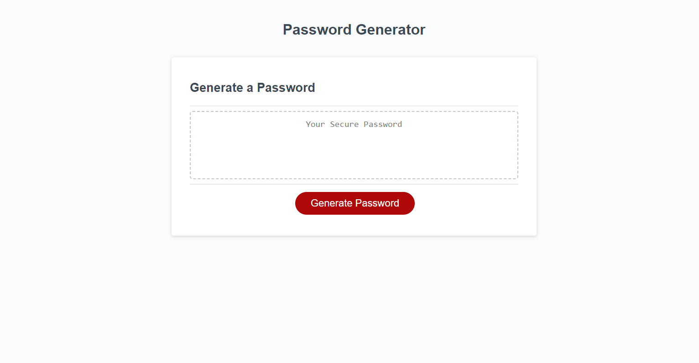

# Random Password Generator

## Description

This is a random password generator that will create a password for the user that can consist of at least one of the following: lowercase letters, uppercase letters, numbers, and special characters. The user will be prompted to make a choice about which characters are included. This generator solves the problem of having to generate a random password on your own.

## Installation

N/A

## Usage

Navigate to the website, click on the large red button that reads "Generate Password" and answer the window prompts as they appear. A randomly generated password will populate in the white text box in the middle of the page. 

url: https://mahlheim.github.io/literate-tribble/

    

 

## License 

Please refer to the license in the repo.
